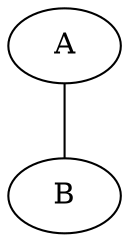

# Hello
## Big Hello

Hello [_there_](https://duckduckgo.com) **this** _**is**_ **_working_**! $\int x^2$...

```python
def fac(i):
	if i < 2:
		return i
	else:
		return i * fac(i - 1)

print(5 * 3 << 2)
print(fac(21))
```

$$
\int_a^b x \; dx = 0
$$

## This is cool :)

> I think `this` Is nice :)


