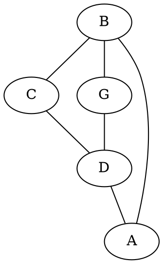

# Big Hello
## Hello wow

Hej _asdfs_!

Fery nice $\sum_2^b x = 12$!

Hello [_there_](https://duckduckgo.com) **this** _**is**_ **_working_**! $\int x^2$...

```python
def fac(i):
	if i < 2:
		return i
	else:
		return i * fac(i - 1)

print(5 * 3 << 2)
print(fac(21))
```

$$
\int_a^b x \; dx = 0
$$

## This is cool :)

> I think `this` Is nice :)
> And not bad



```python
def fib(a):
    if a > 10:
        return -1
	if a < 2:
		return a
	else:
		return fib(a - 1) + fib(a - 2)

for i in range(0, 10):
    print('fib({}) = {}'.format(i, fib(i)))
```

## More to come $(a \leftrightarrow b) \to (a \to b)$

This is the new page.

And it works well :)
